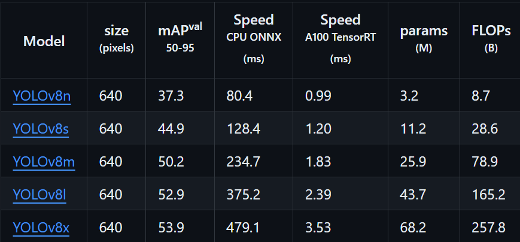

## Building an AI-ML Football Analysis system with YOLO, OpenCV, and Python
### Steps:

1. Install _'ultralytics'_ for YOLO library
2. Make a folder naming it- 'input_video' and add the videos needed as input. The input video is taken from- [Kaggle Dataset](https://www.kaggle.com/c/dfl-bundesliga-data-shootout)
3. Create a python file naming- 'yolo_inference'. This file contains the code for inferencing the input using YOLO library
- YOLO model version 8 is used for the project.
- Also, L in the code refers to Large version of library. 

>Here is the breakdown of the output:  
ultralytics.engine.results.Boxes object with attributes:  
cls: tensor([0.]) **_~ class ID...[0]referes to person_**
conf: tensor([0.8497]) **_~ how confident the model is... more the confidence- more certain it is_**  
data: tensor([[532.8365, 686.9611, 579.4390, 786.6328,   0.8497,   0.0000]])  
id: None  
is_track: False  
orig_shape: (1080, 1920)  
shape: torch.Size([1, 6])  
**~_Bounding Box Config_~**   
xywh: tensor([[556.1378, 736.7970,  46.6025,  99.6717]])   
xywhn: tensor([[0.2897, 0.6822, 0.0243, 0.0923]])  
xyxy: tensor([[532.8365, 686.9611, 579.4390, 786.6328]]) **_~ we will use this_**  
xyxyn: tensor([[0.2775, 0.6361, 0.3018, 0.7284]])  

4. After running the inference code, a folder with name - 'run', will be formed, containing the output video
5. The issue with the output rn are:
- It is detecting person from audience, stands and bench
- It can't differentiate between players and referees
- Ball is often not detected in some frames
6. Make a folder with name- 'training' and create a Jupyter file- 'football_training_yolo_v5'. Here we used version 5 because it has better accuracy for detecting ball
7. From [Roboflow](https://universe.roboflow.com/roboflow-jvuqo/football-players-detection-3zvbc/dataset/1#), download the dataset for testing and training the model
8. After extracting the zip file, a folder with name- [football-players-detection-1](training%2Ffootball-players-detection-1) will be formed. It will contain testing and training data with images and labels
9. Bit about label:  
- 3 0.3677604166666667 0.26045370370370374 0.009479166666666667 0.03280555555555555
- Here, 3 refers to the class being detected. For more details, refer to [data.yaml](training%2Ffootball-players-detection-1%2Fdata.yaml) file. 
- The next 4 numbers refers to the xyxy size of bounding box
10. Move the [football-players-detection-1](training%2Ffootball-players-detection-1) folder within a duplicate folder with same name. It is a necessary step needed for training. For the same, we will write a reproducible code in Jupyter
11. Now, for the TRAINING part, we need Google Collab as it provides GPU for model training.
12. The parameters entitled for training are:  
- task=detect ~ it refers to the task to be done by machine  
- mode=train  ~ the mode in which machine is being used rn
- model=yolov5l.pt  ~ model number and version
- data={dataset.location}/data.yaml ~ location of data 
- epochs=100 ~ One single pass through the whole training dataset is called an epoch
- imgsz=640 ~ refers to the image size of each training data